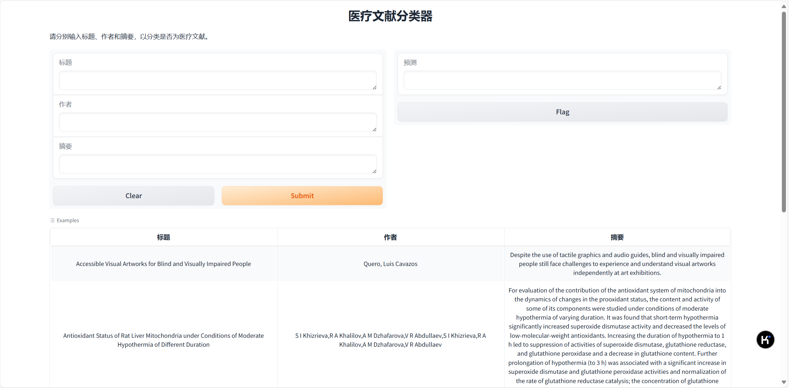

# 医疗文献分类器

这是一个基于 BERT 模型 的医疗文献分类器，旨在帮助用户快速判断一篇文献是否与医疗相关。
该分类器利用了 BERT 强大的文本编码能力，能够有效提取文献中的语义特征，并给出准确的分类结果。

### 功能：
- **输入**：用户可以输入文献的标题、作者和摘要。
- **输出**：系统会根据输入内容，判断该文献是否属于医疗相关领域。

### 使用方法
1. 在bert.ipynb中进行训练，得到model_best.pt
2. 安装`pip install gradio`,该应用基于gradio生成前端界面进行使用
3. 在 `Title` 输入框中输入文献的标题。
4. 在 `Author` 输入框中输入文献的作者。
5. 在 `Abstract` 输入框中输入文献的摘要。
6. 点击 `Submit` 按钮，系统会返回分类结果,判断该文献是否与医疗相关。

### 技术背景:

1.该分类器基于 BERT 模型（Bidirectional Encoder Representations from Transformers），是一种预训练的深度学习模型，能够捕捉文本中的上下文信息，广泛应用于自然语言处理任务。

2.数据集：使用了 DataWhaler 提供的医疗文献数据集，经过大量训练，模型能够有效识别医疗相关的内容。

3.模型架构：BERT 模型用于提取文献的语义特征，后续通过一个简单的全连接层进行二分类（医疗相关或非医疗相关）。

4.模型效率：accuracy: 0.9700, validation loss: 0.2310, F1: 0.9700, Precision: 0.9700
### 开发者：
- 作者：xzxg001
- 联系方式：xzxg001@gmail.com

感谢使用本应用！
